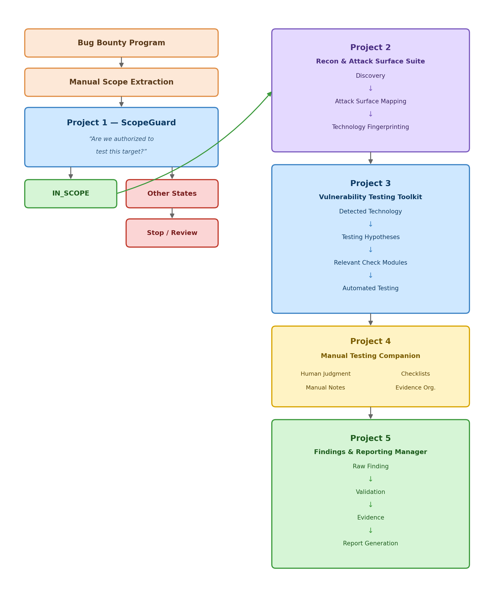

# ScopeGuard

> Deterministic target authorization engine for security testing.

ScopeGuard is **Project 1 of SafeGuard**, a cybersecurity automation project designed to make security testing safer, more structured, and more reliable.

Its purpose is simple:

**Before testing a target, determine whether that target is actually authorized.**

ScopeGuard takes a manually prepared, machine-readable bug-bounty scope definition and checks whether a supplied target is:

- `IN_SCOPE`
- `OUT_OF_SCOPE`
- `UNKNOWN`
- `CONFLICT`

The project follows a **fail-closed security principle**: when authorization cannot be determined safely, ScopeGuard does not assume permission.

---

# SafeGuard Project

SafeGuard is planned as a modular security-testing workflow.

  

